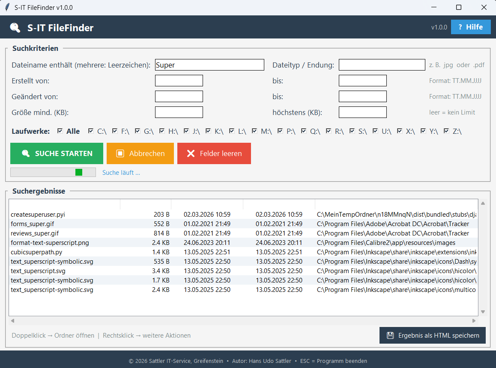

# 🔍 S-IT FileFinder

**Version 1.0.0 · Freeware · Windows 10 / 11 · Deutsch**

Ein einfaches, schnelles Suchwerkzeug für Windows – entwickelt für Menschen, die keine Erfahrung mit der Windows-Suche oder technischen Suchtools haben.

---

## Für wen ist dieses Tool?

Windows-Bordmittel und Tools wie *Everything* sind für erfahrene Nutzer gemacht: man muss wissen, wie man Suchoperatoren eingibt, welche Laufwerke durchsucht werden und wo man überhaupt anfängt. Für viele Anwender – besonders ältere Nutzer, Kunden im IT-Service-Alltag oder Menschen nach einem PC-Umzug – ist das eine echte Hürde.

**S-IT FileFinder** bietet stattdessen:

- **Klare, beschriftete Eingabefelder** – kein Raten, was wohin gehört
- **Laufwerke einfach anklicken** – einzeln oder alle auf einmal
- **Suche nach Namensbruchstücken** – auch wenn nur ein Teil des Dateinamens bekannt ist
- **Datum und Dateigröße eingrenzen** – ohne Syntaxkenntnisse
- **Ergebnisse sofort nutzbar** – Datei öffnen, Ordner zeigen, Pfad kopieren, verschieben

---

## Funktionen

### Suchkriterien
| Feld | Beschreibung |
|---|---|
| **Dateiname enthält** | Ein oder mehrere Bruchstücke, durch Leerzeichen getrennt (UND-Verknüpfung) |
| **Dateityp / Endung** | z. B. `jpg`, `.pdf`, `docx` – mit oder ohne Punkt |
| **Erstellt von / bis** | Datum im Format `TT.MM.JJJJ` |
| **Geändert von / bis** | Datum im Format `TT.MM.JJJJ` |
| **Größe mind. / höchstens** | In Kilobyte – beide Felder optional |

Alle Felder sind optional und frei kombinierbar.

### Laufwerke
Alle erkannten Laufwerke (lokal und eingebundene Netzlaufwerke) erscheinen automatisch als Checkboxen. Mit **„Alle"** werden sämtliche Laufwerke auf einmal an- oder abgehakt.

### Ergebnistabelle
- **Doppelklick** → Ordner im Explorer öffnen, Datei markiert
- **Rechtsklick** → Kontextmenü mit:
  - Ordner im Explorer öffnen
  - Datei direkt öffnen
  - Pfad in Zwischenablage kopieren
  - Datei kopieren oder verschieben

### HTML-Export
Mit **„Ergebnis als HTML speichern"** wird die komplette Trefferliste als HTML-Datei gespeichert und automatisch im Browser geöffnet. Dateinamen und Ordnerpfade sind dort direkt anklickbar.

---

## Screenshot



---

## Download

Die aktuelle Version als kompilierte Windows-EXE ist auf den **[Releases-Seite](../../releases)** verfügbar.

Folgende Dateien gehören zusammen in einen Ordner:

```
S-IT-FileFinder.exe
S-IT-FileFinder-Hilfe.html
```

Die Hilfedatei wird über den **„? Hilfe"**-Button im Programm geöffnet.

---

## Installation

Keine Installation notwendig. EXE und HTML-Datei in einen beliebigen Ordner legen und `S-IT-FileFinder.exe` starten.

---

## Technische Hinweise

- Entwickelt mit Python und tkinter
- Kompiliert mit PyInstaller (`--onefile --windowed`)
- DPI-Awareness für HiDPI-Monitore und Skalierungen bis 175 % und mehr
- Suche läuft im Hintergrund-Thread, Fenster bleibt jederzeit bedienbar
- Windows-Systemordner (`Windows`, `$Recycle.Bin` u. a.) werden auf C:\ automatisch übersprungen
- Gesperrte Ordner werden ohne Absturz übersprungen, Anzahl wird in der Statuszeile angezeigt
- Keine Administratorrechte erforderlich

---

## Unterstützung / Spende

S-IT FileFinder ist kostenlos und ohne Einschränkungen nutzbar.  
Wer das Tool nützlich findet, darf mich gern über PayPal unterstützen:

**[tool-entwicklung@sattler-it.de](mailto:tool-entwicklung@sattler-it.de)**

---

## Weitere Tools

Weitere Freeware-Tools von Sattler IT-Service:

- **[S-IT LAN Device Scanner](https://www.wintotal.de/download/s-it-lan-device-scanner/)** – Netzwerkgeräte scannen, identifizieren und dokumentieren

---

## Lizenz

© 2026 Sattler IT-Service, Greifenstein  
Autor: Hans Udo Sattler  

Freeware – kostenlose Nutzung und Weitergabe erlaubt.  
Kommerzielle Weiterverwendung oder Modifikation ohne Genehmigung nicht gestattet.
